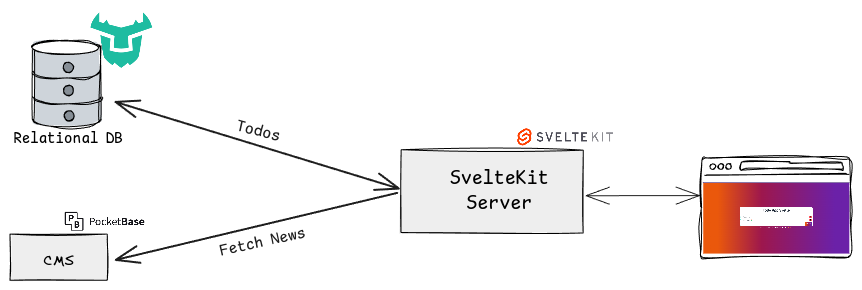
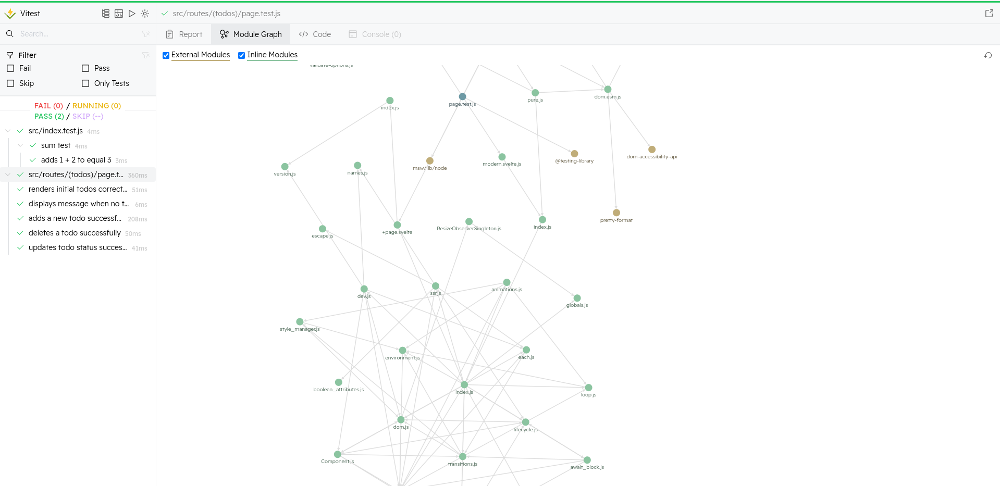
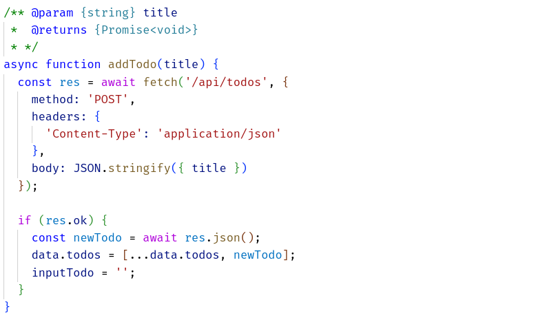
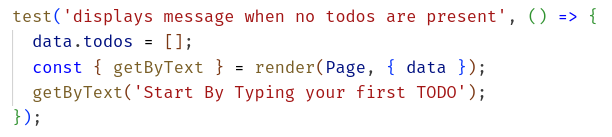
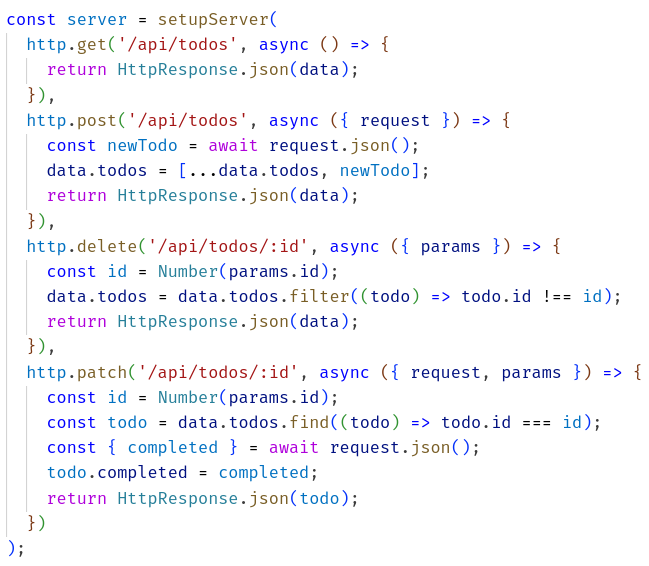
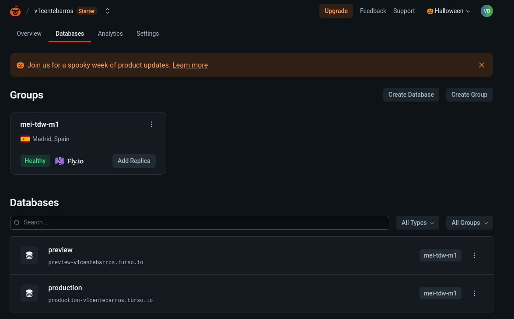
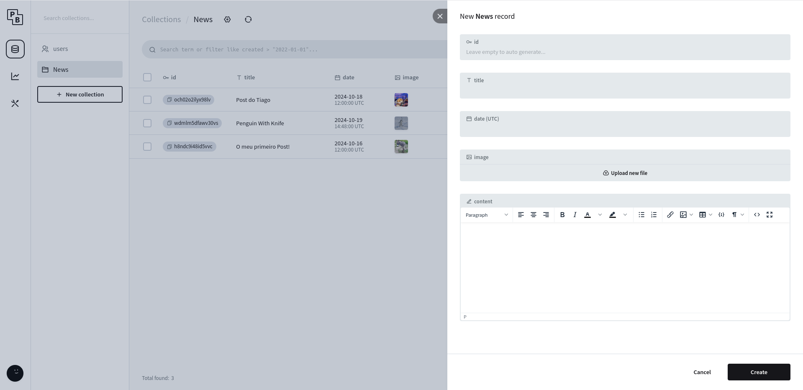
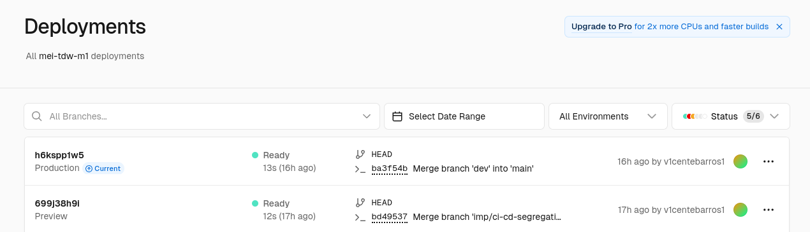
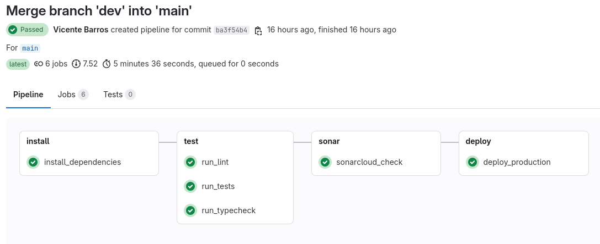

# Mini project M1B - TDW (TODO App)

## Overview

The main goal of this project is to study CI/CD pipelines and the importance of them in the development process. The project consists in a simple todo list application that store the todos inside a database which will be further explained in the next sections.
Furthermore, there is a news page that fetches data from a CMS API and displays the news in a list.

## Links
- [Production](https://mei-tdw-m1.vercel.app/)
- [Gitlab Repository](https://gitlab.com/v1centebarros/mei-tdw-m1)
- [Gitub Repository](https://github.com/v1centebarros/mei-tdw-m1)
- [SonarCloud](https://sonarcloud.io/project/overview?id=v1centebarros_mei-tdw-m1)

## Features

- [x] **View Todos**: A page to view all the todos.
- [x] **Add Todo**: A form to add a new todo.
- [x] **Delete Todo**: A button to delete a todo.
- [x] **Mark Todo as Done**: A button to mark a todo as done.
- [x] **View News**: A page to view the news.

## Tech Stack

This project was thought to use different technologies from the ones used in class. The tech stack is as follows:


### SvelteKit

[SvelteKit](https://kit.svelte.dev/) is a framework for building web applications with Svelte. It is a powerful tool that allows developers to create applications with ease and speed. SvelteKit provides a great developer experience and is highly performant.
The SvelteKit can work as frontend and backend, due to the server-side rendering feature. All the business logic of the TODO app is possible with SvelteKit while the News is fetched from a CMS API which will be explained in the next sections. 
The first challenge of using this framework while using svelte was the different approach from React. 

Svelte compiles components to efficient imperative code that directly manipulates the DOM, while React uses a virtual DOM to batch updates and optimize rendering. Svelte is generally faster due to its compilation step, which eliminates the overhead of a virtual DOM, whereas React is slightly slower due to the virtual DOM diffing process. Svelte manages state within components using reactive assignments, while React uses hooks (e.g., useState, useReducer) and external libraries (e.g., Redux) for state management. 
Svelte is easier to learn for beginners due to its simpler syntax and less boilerplate, whereas React has a steeper learning curve due to the need to understand JSX, hooks, and the virtual DOM. Svelte uses a more HTML-like syntax with \<script\> tags to handle the logic part of the component, while React uses JSX, which mixes HTML with JavaScript. Svelte has a built-in reactivity system that automatically updates the DOM when state changes, whereas React requires explicit state updates and re-renders using hooks.

The development of the application started by the development of the Todo Application. The routes were seperated between the Todo, api and news. The todo folder needed the parenthesis between to do not use the path /todos as route and use the root route instead. Afterwards, the api folder is where the REST apis is located with the CRUD endpoints of the todos. Finally, the news route is responsible to display and fetch the data from the CMS.

Each page generally consisted in two files `+page.server.js` `+page.svelte`. SvelteKit is server-side render firstly and the `+page.server.js` is responsible to fetch the data from the database and prepare to serve. Then `+page.svelte` will pick the information and display and provide a way to the user interact with it.

Concluding, Svelte proved to be a simple yet powerful frontend framework giving an easy-going experience when developing the application and was a good to leave the React Eco-system.

### DrizzleORM

[DrizzleORM](https://orm.drizzle.team/) is an Object-Relational Mapping (ORM) library which provides a simples way to interact with databases. The interaction with the Todo database is done through DrizzleORM simplifying the process of creating, reading, updating and deleting data through migrations and models.

The key difference from Drizzle to other ORMs is the SQL-like syntax which makes the developer experience more interesting and more close to the database.

DrizzleORM was a good experience when developing, but since is a bleeding-edge technology some integrations, mainly in the typechecking was particular difficult. The Drizzle Studio was a good tool to use and in large projects can be helpful. 

### Turso

[Turso](https://turso.tech/) is a distributed, edge-hosted SQL database designed to provide low-latency data access by running closer to end-users geographically. Turso builds upon libSQL, an open-source and cloud-native fork of SQLite, to offer a developer-friendly and scalable database solution for modern applications.
For this project, Turso is used to store the todos created by the user and to create a production and preview. The first step to start using Turso was to select a region where the databases will be stored, since we wanted to use the Free tier only one location was selected but Turso offers the capability to have data redundancy across different locations. 

Since Turso is one of the main sponsors of Drizzle, the integration turned to be smoothly since the only difference between SQLite and Turso was the driver to use. 

### PocketBase
[PocketBase](https://pocketbase.io/) is an open-source backend framework designed to simplify and accelerate the development of modern applications. Written in the Go programming language, PocketBase provides a self-contained, portable backend solution that includes a real-time database, user authentication and authorization, file storage, and an admin dashboard—all accessible through a RESTful API.
In this project PocketBase is used to fetch the news from the collection using the PocketBase toolkit while hosted in [pockethost.io](https://pockethost.io).

The first step was to define the news collection type with the specific fields. One key field is the content field which allows the insertion of html to be rendered in the frontend. Svelte provides a @html tag to that matter.

Pocketbase is a powerful CMS with its toolkit simplified the calls without the need of using the REST api.

# CI/CD Tools

A side goal of the project was to study different tools from the ones learned in class.
The main development platform was Gitlab since it was not used during classes. Gitlab provided a simpler approach than Github. 
Thus, the project uses the following tools apart from the ones listed bellow:

### Vitest

Instead of using Jest, the project uses [Vitest](https://vitest.dev/). Sveltekit uses Vite as a bundler and Vitest is a testing framework that is built on top of Vite. It is a fast and lightweight testing framework that provides a great developer experience being faster and using less resources than Jest. A main difference is that Vitest runs the tests in the browser, which allows the developer to debug the tests in the browser through an UI.


### JSDoc

SvelteKit developer team prefers the usage of JSDoc over TypeScript for documenting the code and providing type checking because of its simplicity and ease of use. JSDoc is a markup language used to annotate JavaScript source code files.
The JSDoc works by adding comments to the code that will be parsed by type checking tools. During the development of this project JSDocs brought some problems more specifically with the DrizzleORM library, which is still in beta and has some issues with the JSDoc type checking.


### Testing Library 

The Testing Library is a set of helpers that allows to test the components in a way that is closer to how the user interacts with the application. The Testing Library is used to test the components of the project and to ensure that the application is working as expected.



### Mock Service Worker

Since the application is doing REST request to make CRUD operations in the database, the Mock Service Worker is used to mock the requests and responses. This way, the tests can be run without the need of a real server running.


### Husky and Lint-Staged

Husky is a tool that allows to run scripts before certain git commands are executed. Lint-Staged is a tool that allows to run scripts on the files that are staged in git. This way, the code is linted and formatted before being committed to the repository. This ensures that the code is always formatted and linted and that the code style is consistent by running the ESLint and Prettier scripts before the code is committed.

### Sonar Cloud

Sonar Cloud is a tool that provides continuous code quality. It analyzes the code and provides insights on the code quality, security, and maintainability. It also provides code coverage reports and can be integrated with the CI/CD pipeline to ensure that the code quality is always high. Unfortunately it was not possible to use the code coverage capability because of the way SvelteKit works which code coverage tools such as v8 and istanbul are not compatible with.

## CI/CD Pipeline

In this project, a CI/CD pipeline was set up using GitLab CI to automate the process of installing dependencies, running tests, ensuring code quality, and deploying the application. The pipeline is organized into multiple stages to streamline development and ensure the quality of the codebase at each step. The following sections explain the key stages of the pipeline:

### 1. Install Stage
The first stage, **Install Dependencies**, ensures that all necessary project dependencies are installed using `npm ci`. This stage runs whenever there is a merge request or code pushed to the main or development branches. It caches the `node_modules` directory for faster future runs. This stage ensures that the environment is properly set up before further steps can proceed.

```yaml
install_dependencies:
  stage: install
  image: node:20
  script:
    - echo "Installing dependencies"
    - npm ci
  cache:
    key: npm-cache
    paths:
      - node_modules/
  only:
    - merge_requests
    - main
    - dev
    - develop
```

### 2. Test Stage
The **Test Stage** is crucial for verifying the correctness of the code. It consists of several jobs:

- **Type Checking**: Runs static type checks using the project's tools to ensure there are no type-related errors.

```yaml
run_typecheck:
  stage: test
  image: node:20
  dependencies:
    - install_dependencies
  script:
    - echo "Running type checks"
    - npm run check
  only:
    - merge_requests
    - main
    - dev
    - develop
```

- **Linting**: Ensures that the code follows the project's coding standards using linters.

```yaml
run_lint:
  stage: test
  image: node:20
  dependencies:
    - run_typecheck
  script:
    - echo "Running lint checks"
    - npm run lint
  only:
    - merge_requests
    - main
    - dev
    - develop
```

- **Testing**: Executes the project's test suite to verify that the application behaves as expected. This stage is essential to catch any issues early.

```yaml
run_tests:
  stage: test
  image: node:20
  dependencies:
    - run_lint
  script:
    - echo "Running tests"
    - npm test
  only:
    - merge_requests
    - main
    - dev
    - develop
```

### 3. SonarCloud Analysis
To ensure code quality, the pipeline integrates with SonarCloud. This stage runs an analysis on the codebase, checking for issues related to code quality, security vulnerabilities, and code smells. The results are reported back to the development team to maintain high standards.

```yaml
sonarcloud_check:
  stage: sonar
  image:
    name: sonarsource/sonar-scanner-cli:latest
  dependencies:
    - run_tests
  script:
    - echo "Running SonarCloud analysis"
    - sonar-scanner -Dsonar.projectKey=v1centebarros_mei-tdw-m1 -Dsonar.organization=v1centebarros-gitlab
  only:
    - merge_requests
    - main
    - dev
    - develop
```

### 4. Deploy Stage
Finally, the pipeline includes two deployment stages:

- **Preview Deployment**: Deploys the application to a preview environment using Vercel. This deployment allows developers to review the changes before they are pushed to production.

```yaml
deploy_preview:
  stage: deploy
  image: node:20
  dependencies:
    - run_tests
  script:
    - echo "Deploying to preview site"
    - npm install --global vercel
    - vercel pull --yes --environment=preview --token=$VERCEL_TOKEN
    - vercel deploy --prebuilt --token=$VERCEL_TOKEN
  only:
    - dev
```

- **Production Deployment**: When changes are merged into the main branch, the application is deployed to production.

```yaml
deploy_production:
  stage: deploy
  image: node:20
  dependencies:
    - run_tests
  script:
    - echo "Deploying to production"
    - npm install --global vercel
    - vercel pull --yes --environment=production --token=$VERCEL_TOKEN
    - vercel deploy --prebuilt --prod --token=$VERCEL_TOKEN
  only:
    - main
```


## Screenshots

### Turso Dashboard


### PocketBase Dashboard


### Vercel Dashboard


### SonarCloud Dashboard
It's public and can be accessed [here](https://sonarcloud.io/project/overview?id=v1centebarros_mei-tdw-m1)

### GitLab CI/CD Pipeline
